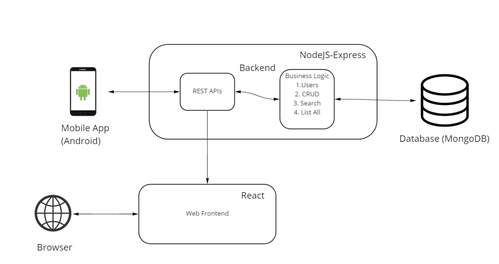
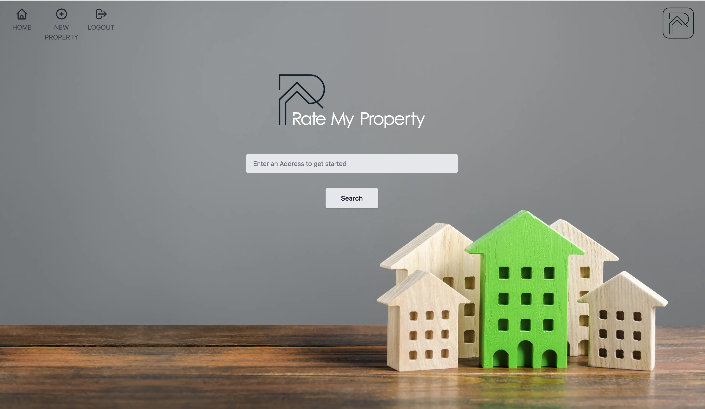

# About

#Problem Statement
Within the realm of contemporary housing websites, property listings are predominantly published by the property owners themselves. However, these postings occasionally exhibit deficiencies and misrepresentations, thereby potentially leading tenants and buyers astray. 


#What are we creating? 
RateMyHousing stands apart as a unique website where individuals who have personally resided in the properties take the helm by providing comments and feedback. Through this distinct approach, the platform offers an exclusive perspective, allowing users to access valuable insights and genuine recommendations directly from those who have experienced living in rentals or properties. In essence, the tenants and former occupants play a pivotal role in shaping the centralized information center, guiding others in making informed decisions throughout their housing journey.


# Tech



## Backend

The backend is developed using Node-JS express framework. For the database,NoSQL (MongoDB) is used for storing data. Unit tests are done using jest and supertest.

## Frontend

The frontend application is developed using Reactjs. The react application will be able to consume APIs and connect to the backend. These apps are built to be deployed using AWS EC2 and S3 (Current S3 image storage feature is not functional).

# Latest Update

This application has been containerized, to run this application install docker and run the script 'startRMH.sh' as shown below. It's gonna take a while to build the first time. Once installed, it will launch quickly. Also be mindful of the space as it runs in 3 containers ( approx 2.5GB )

1. ```chmod +x rs-init.sh``` <br>
2. ```chmod +x startRMH.sh``` <br>
3. ```./startRMH```


In case of any trouble running the script try this command on the script. (The script was written in Windows and due to that windows adds a extra character at EOL which posix based systems do not do)

```sed -i -e 's/\r$//' scriptname.sh```

Reference: https://stackoverflow.com/questions/14219092/bash-script-and-bin-bashm-bad-interpreter-no-such-file-or-directory


# Screenshots

Home Page


Search Results


Add Property Form


Property Page


Reviews


Admin Home Page


Admin Control


Sign Up Page

